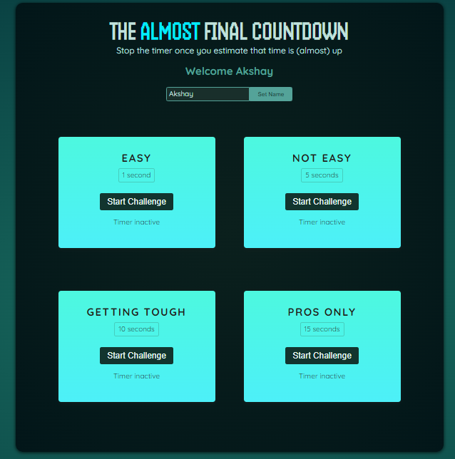
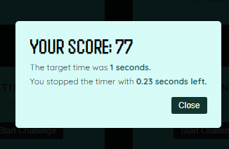

### playCounter App

Welcome to the playCounter App! This app allows you to test your timing skills with various challenges.

#### Features:

- **Player Name Setting:** Set your name to personalize the experience.
- **Multiple Challenges:** Engage in different challenges with varying target times.
- **Timer Control:** Start and stop the timer for each challenge.
- **Result Display:** Know your score and remaining time for each challenge.

#### Screenshots:

#### How to Use:

1. Enter your name in the provided input field and click "Set Name".
2. Choose a challenge from the list presented.
3. Click "Start Challenge" to begin the timer.
4. Stop the timer by clicking "Stop" if needed.
5. Once the challenge is complete, a modal will display your score and other details.
6. Click "Close" to reset the challenge and try again.

#### Components:

1. **App.jsx:** The main component orchestrating the player setup and challenge rendering.
2. **Player.jsx:** Allows the user to set their name.
3. **TimerChallenge.jsx:** Manages individual timer challenges and their interactions.
4. **ResultModal.jsx:** Displays the result of each challenge, including score and remaining time.

#### Technologies Used:

- React
- JavaScript

Feel free to contribute or customize the app as needed! Happy timing!